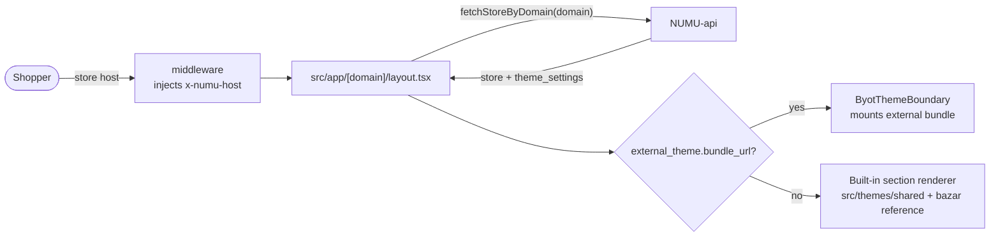

# NUMU Storefront — V3 BYOT Theme Host

The **primary customer storefront** for the NUMU platform and the runtime host of the **V3 theme engine (BYOT — "Bring Your Own Theme")**. Themes are independently-built ESM bundles loaded over HTTPS at runtime; this app embeds almost no theme UI itself.

Built with **Next.js 16 (App Router)**, React 19, TypeScript — deliberately minimal dependencies (+ `@numueg/theme-sdk`).

> Stores still on a V2 in-tree theme are served by [`numu-egyptian-bazaar`](../numu-egyptian-bazaar) instead.

---

## Table of contents

- [How it works](#how-it-works)
- [Routes](#routes)
- [BYOT mount seam](#byot-mount-seam)
- [Checkout fork](#checkout-fork)
- [Getting started](#getting-started)
- [Environment variables](#environment-variables)
- [Caveats](#caveats)

---

## How it works



- Theme bundles + CSS are produced by `@numueg/theme-plugin` builds and served from CDN/R2.
- `predev`/`prebuild` runs `scripts/build-runtime.mjs` which generates `public/__numu-runtime/` — the **federation import map** that lets every theme resolve `react`, `react-dom`, and `@numueg/theme-sdk` to host-loaded singletons (one React identity platform-wide).
- Per-store **password gate** (pre-launch) is handled in the layout from `settings.password_protected`.

## Routes

Under `src/app/[domain]/`:

`account/` · `blogs/` · `cart/` · `checkout/{,shipping,payment,review,processing}` · `collections/` · `pages/` (CMS pages) · `password/` · `pay/` · `policies/` · `products/` · `search/` · **`[...slug]`** catch-all (no-404 engine — unknown paths resolve through the theme).

API routes (`src/app/api/`): `cart`, `checkout`, `collections`, `customer`, `gift-cards`, **`image-transform`** (focal-aware crops used by SDK `focalSrc()`), `pay` (payment proxy), `products`, `revalidate` (ISR webhook), `shipping`, `storefront` (track proxy), `whatsapp` (consent proxy).

## BYOT mount seam

`src/components/theme-engine/ByotThemeBoundary.tsx` is the **source of truth for the host↔theme contract**:

1. Validates `bundle_url` against an allowlist (`*.numueg.app`, `*.numu.io`; `*.r2.dev` dev-only) + optional SHA-256 checksum.
2. Dynamically imports `theme.js` + loads `theme.css`.
3. Calls the bundle's `mount(el, ctx)` where `ctx = { storeData, page, themeSettings, locale, … }`.
4. Modern bundles return `{ unmount(), update(props) }` (live-edit support); legacy bundles return a cleanup function.

Themes should use the SDK's `mountTheme(el, ctx, renderApp)` helper, which wires catalog/styles/navigation/live-preview consistently.

Static `error.html` / `loading.html` templates declared in a theme's `theme.json` render during error/loading states.

## Checkout fork

Checkout is **platform-owned by default** (Shopify model). `src/lib/byot-fork.tsx` decides per-request:

- Theme declares `external_theme.capabilities.checkout === true` → bundle owns checkout pages.
- Otherwise (all current production themes) → built-in multi-step checkout (`contact → shipping → payment → review → processing`) wrapped in platform chrome.

## Getting started

```bash
npm install
npm run dev            # builds __numu-runtime, then next dev on :3100
npm run dev:turbopack  # Turbopack variant
npm run build
npm run start          # node scripts/start.mjs (loads runtime env)
```

## Environment variables

| Variable | Kind | Description |
|----------|------|-------------|
| `NUMU_API_URL` | runtime | NUMU-api base — **must include `/api/v1`** |
| `NUMU_PLATFORM_DOMAIN` | runtime | Platform domain for host→store resolution (e.g. `localhost:3100`) |
| `REVALIDATION_SECRET` | runtime | Guards `POST /api/revalidate` |
| `NEXT_PUBLIC_NUMU_ENV` | build | Environment name (inlined) |
| `NEXT_PUBLIC_GOOGLE_MAPS_KEY` | build | Optional — checkout location picker disabled if unset |

> ⚠️ **`next start` does NOT read `.env.local` server vars.** Runtime vars must be present in the shell (or provided by `scripts/start.mjs`) — otherwise SSR calls the wrong API and every store renders "Store not found".

## Caveats

- The host↔theme `ctx` shape is defined **here** (ByotThemeBoundary), not in SDK type defs — when they disagree, this repo wins.
- Bundle installs are refused when the bundle's `sdk_compat_major` ≠ host's.
- `EDGE_ROUTING.md` documents the Cloudflare Workers edge-routing setup in front of this app.
- Cache busting: revalidation must target both `store-` and `theme-` tags; prefer immediate-expiry revalidation over default stale-while-revalidate for publishes.
